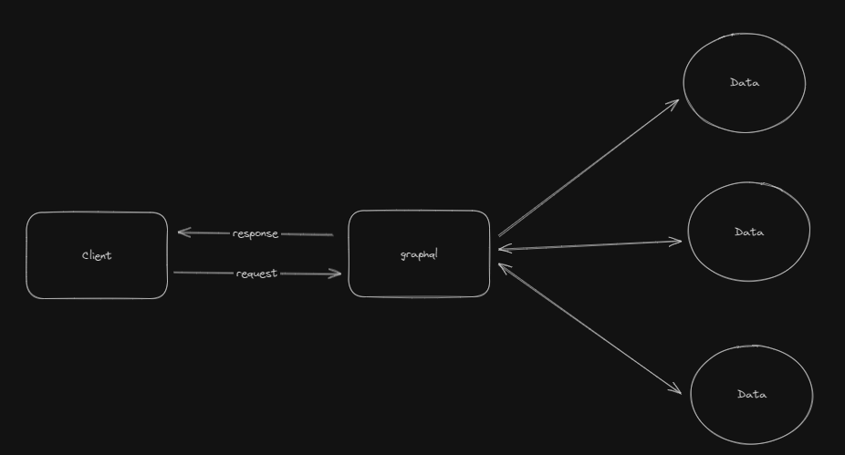
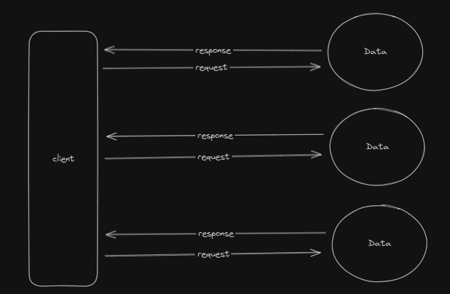

## Apa Itu GraphQL?

Graphql adalah query language untuk API, dan sebuah server side runtime untuk eksekusi query menggunakan sebuah sistem type yang kamu definisikan untuk data kamu, dengan tujjuan untuk mendapatkan sebuah API yang lebih fleksible dan efesien.

### Perbedaan GraphQL dan REST API

- REST API
  - REST memungkinkan aplikasi client untuk bertukar data dengan server mengguanakn HTTP, yang merupakan protocol komunikasi standar internet.
- GraphQL
  - GraphQL adalah query language untuk API yang menentukan spesifikasi mengenai bagaimana seharusnya aplikasi client meminta data dari server jarak jauh.

### Diagram REST and GraphQL

- GraphQL
  
- REST
  

### Core concepts of GraphQL

GraphQL memiliki 3 fitur utama:

- Queries -> pengambilan data khusus untuk memberikan apa yang diminta client.
- Mutations -> mengizinkan klien untuk mengubah atau memperbarui data di server.
- Subscriptions -> Subscriptions memfasilitasi komunikasi dua arah dan real-time antara cliet dan server.

### Benefits of GraphQL

GraphQL pada awalnya dikembangkan untuk mengatasi beberapa keterbatasan REST API, seperti pengambilan data yang berlebihan. GraphQL juga menyediakan cara yang elegan untuk meminta dan memanipulasi data.
